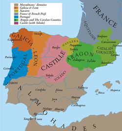

# Soldier & Dice - MEDIEVAL SPAIN VERSION (Risk)
*[Felipe Yuji Deguchi hayashi]*

*[Data Analytics Full Time, Barcelona & Jun/2020]*

## Content
- [Project Description](#project-description)
- [Rules](#rules)
- [Workflow](#workflow)
- [Organization](#organization)
- [Links](#links)

## Project Description
I have always liked that involve risk calculation like Settlers of Catan, Poker or Risk itself. Because of that I decided to take on the task of building a risk inspired game on python for this project.

The game setting is Medieval Spain, where the Kingdoms of Catalonia, Castille and Galicia fight for Supremacy.

## Rules

**Starting Conditions**

- Players start with 1 random territory and 3 soldiers each.

**Winning Condition**

In our variation of the game the winning condition is to be the last player standing. That means that the last player with remaining armies wins the game.

**Game Dynamic**

-Each player takes turns choosing whether to attack another player or to pass the turn.
-Players can keep atacking as long as they have more than one soldier.(1 Soldier always have to stay behind defending territory)
-Maximum soldiers per attack is 3.
-Attackers roll 1 dice per soldier deployed(maximum of 3). Defenders rolls 1 dice per defender deployed(minimum of 1 maximum of 3). Results are compared(with sorted results, highest vs. highest) with defense winning in case of a tie. Soldiers that lost are eliminated from the game. 
-At the end of each turn, every player gets a new soldiers in each territory controlled.

## Workflow

-First step was to ressearch the rules of the game and create a mvp of a rules that could be implemented on python with my current level of knowlodge.

-Second plan would plan on trello the main taks and deliverables for executing the project, considering workload estimated and available hours of the resources(Only Me).

-Third Step - Execute and correct errors.

-Final Step - Create presentation and present on Friday.

## Organization

I used Trello to creat a list of tasks and deadlines.

The repository contains the main code for the game, an Image for the Readme File, and a gitignore file.